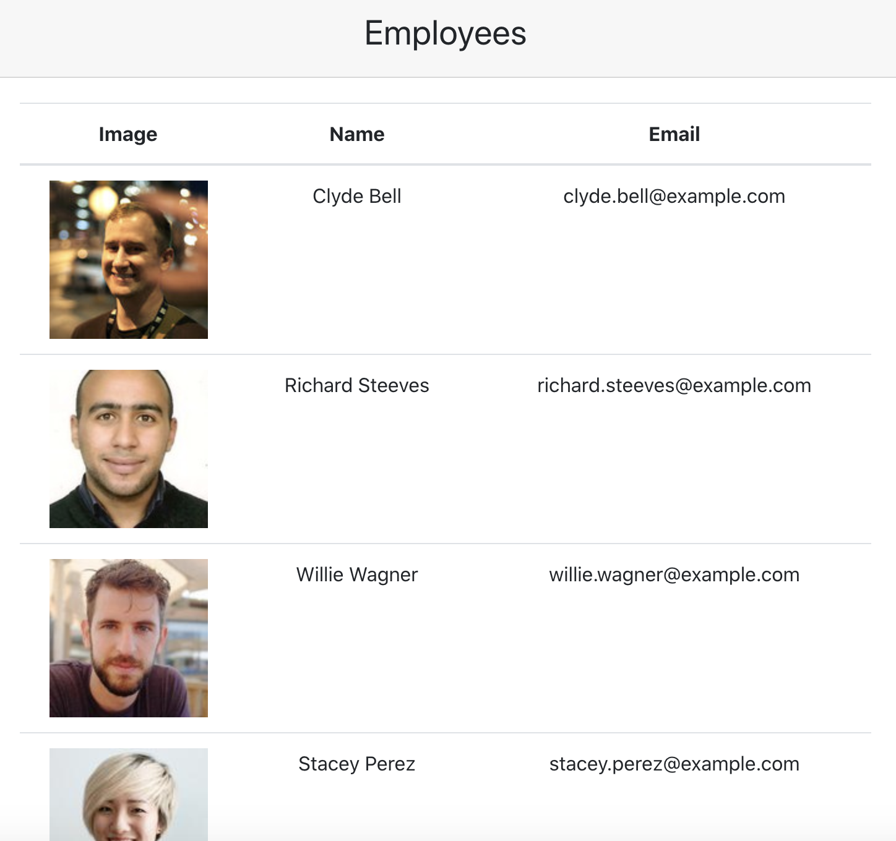

## Employee Directory

<a href="https://vartanyane.github.io/employee-directory/">Try It Out</a>

## Description

Employee-Directory-Search a list of employees-filter by first name-sort by DOB.

## Table of Contents

- [Installation](#Installation)

- [Technologies](#Technologies)

- [Motivation](#Motivation)

- [Questions](#Questions)

## Motivation

This project was motivated by the UCLA Bootcamp.

## Installation

To install necessary dependencies, run the following command.

    npm install

## Technologies

    HTML/CSS/BOOTSTRAP/JAVASCRIPT/REACT

## Questions

<a href="https://vartanyane.github.io/portfolioFinal/">If you have any questions please contact me</a>
